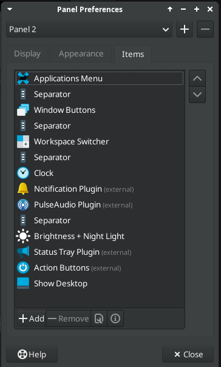
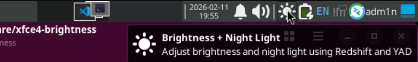
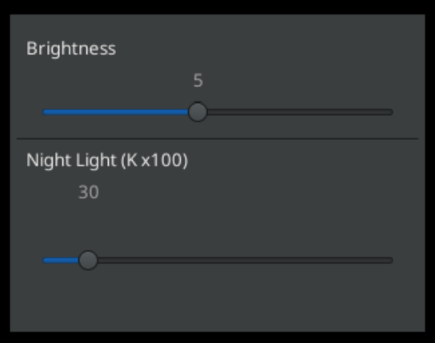

# X11 Brightness + Night Light

A small, fast desktop utility that gives you **two live sliders** in one window:

- `Brightness` (screen intensity)
- `Night Light` (color temperature)

Built with **YAD + Redshift** for people who want practical screen controls without opening system settings every time.

## Screenshots

**Panel preference view**  
The launcher/settings setup used to add and pin the tool.
<p align="center">
  
</p>

**Panel icon view**  
How the Brightness + Night Light icon appears in the panel once added.
<p align="center">
  
</p>

**Flyout view**  
The live control window with brightness and night light sliders.
<p align="center">
  
</p>

## Why This Exists

Some desktops make brightness and color temperature controls awkward, hidden, or inconsistent across setups.
This tool puts both controls in one lightweight launcher so you can tune your display in seconds.

## Features

- Dual-slider UI for brightness + warmth
- Lightweight and scriptable (shell-based)
- Works well with X11 desktop workflows and launchers
- Compatible with several **X11** desktop environments

## Requirements

- Linux desktop session on **X11**
- `redshift`
- `yad`
- `bc`

`install_brightness+nightlight.sh` automatically installs missing `redshift`, `yad`, and `bc` using `apt` (Debian/Ubuntu-based systems).

## Install

```bash
chmod +x install_brightness+nightlight.sh
./install_brightness+nightlight.sh
```

## Usage

- Open your application menu
- Launch **Brightness + Night Light**
- Adjust sliders live until your screen feels right

## Desktop Compatibility

Tested and intended for:

- X11 desktops (tested on XFCE 4)
- MATE
- LXDE / LXQt
- Cinnamon
- GNOME on X11
- KDE Plasma on X11

## Wayland Note

Wayland is **not supported**.

This utility uses Redshift/XRandR behavior that is designed for X11. On Wayland, results are often inconsistent or no-op.

## Add to Panel / Dock

- XFCE 4: Right-click panel -> `Add New Items` -> `Launcher` -> add **Brightness + Night Light**
- GNOME (X11): Activities -> search app -> right-click -> `Add to Favorites`
- KDE Plasma (X11): Application Launcher -> search app -> right-click -> `Add to Panel`
- Cinnamon (X11): Menu -> search app -> right-click -> `Add to panel`
- MATE (X11): Right-click panel -> `Add to Panel` -> `Custom Application Launcher`
- LXDE: Right-click panel -> `Add/Remove Panel Items` -> `Application Launcher`
- LXQt: Right-click panel -> `Add Widgets` -> `Quick Launch`

## Troubleshooting

- Controls do nothing:
  - Verify X11 session:
    ```bash
    echo "$XDG_SESSION_TYPE"
    ```
    Expected output: `x11`
  - Verify Redshift can control your display:
    ```bash
    redshift -P -O 4500K -b 0.8
    ```

- Night light has little/no effect:
  - Some GPUs/drivers ignore temperature changes.
  - Try wider values (for example: `3000K` to `6500K`).

## Uninstall

Remove installed files:

```bash
rm -f ~/.local/bin/redshift-slider.sh
rm -f ~/.local/bin/redshift-nightlight.sh
rm -f ~/.local/share/applications/redshift-slider.desktop
rm -rf ~/.local/share/redshift-slider
```

Optional: restore default Redshift settings:

```bash
redshift -x
```

## Contributing

Issues and pull requests are welcome.

If you report a bug, include:

- Desktop environment + version
- X11/Wayland session type
- GPU/driver info
- Output from any failing command

## Author

`namar0x0309`

Made with gratitude 🤲

## License

This project is licensed under **GNU GPL v3.0 or later** (`GPL-3.0-or-later`).

See `LICENSE` for the full text.
